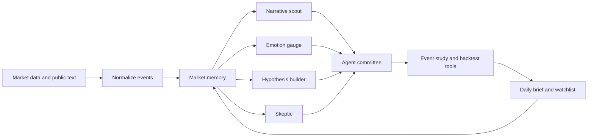

# Architecture

AshareAgentLab is organized around an agentic decision-support loop rather than a factor library.

## Design Rules

- Keep adapters thin. Data-source code should fetch and normalize, not decide.
- Keep agents small. Each role has one job and returns structured reports.
- Keep memory auditable. Store original event payloads with dates, source names, and summaries.
- Keep verification deterministic. LLMs may propose hypotheses; code tests them.
- Keep live trading out of this repository until research evidence is strong.

## Extension Points

- Add market data by implementing `DataSource.load_events`.
- Add an agent by subclassing `Agent` and registering it in `AgentCommittee`.
- Add a validation method under `research/`.
- Add a new OpenAI-compatible provider by extending `PROVIDER_BASE_URLS` and `PRICING`.

## Early Module Boundaries

`agents` may call `llm`, but should not know provider-specific pricing.

`data` should not call `llm`; public discussion crawlers should return raw text evidence.

`research` should accept DataFrames or typed records and return reproducible metrics.

`memory` stores facts and generated artifacts, but not secrets.

